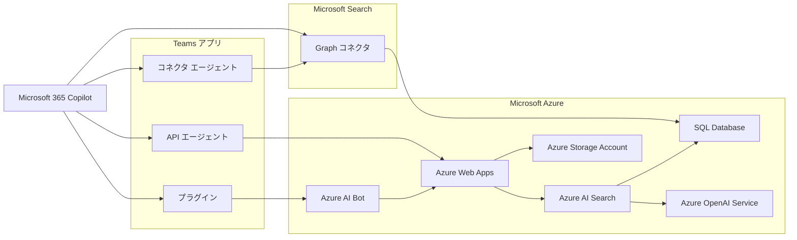

# 徹底解説！Microsoft 365 Copilotの拡張機能

[Japan Microsoft 365 コミュニティ カンファレンス 2024](https://japan-m365-community-conference-2024.connpass.com/event/332074/) のセッション A04 で行われる「徹底解説！Microsoft 365 Copilotの拡張機能」のデモ資料です。

## フォルダー構成

- **bicep**: Azure リソースを作成するためのテンプレートを格納します。
- **index**: Azure AI Search のデータ ソース、スキルセット、インデックス、インデクサーの設定情報を格納します。
- **manifest**: Teams アプリのマニフェスト ファイルを格納します。
- **source**: Teams メッセージ拡張機能をホストするボットおよび API プラグインの接続先となる Web API を実装するコードを格納します。
- **sql**: Azure SQL Database のテーブル定義およびデータ定義を格納します。

## アーキテクチャ

